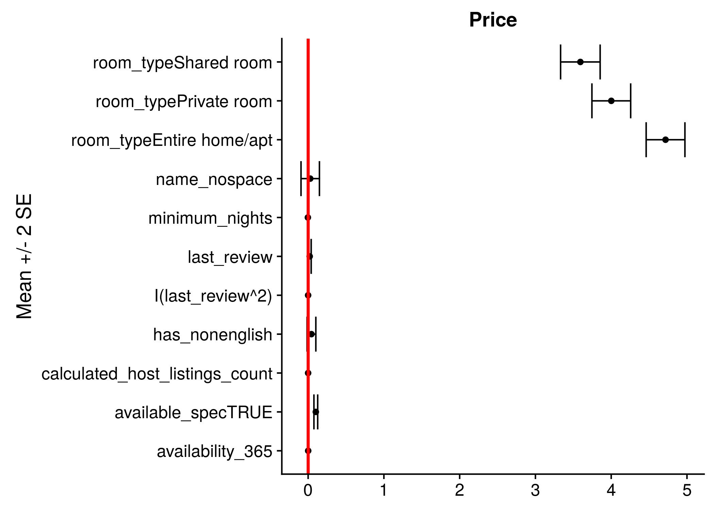
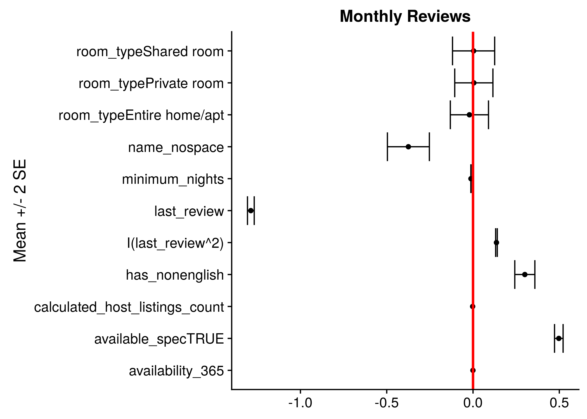

```{r setup, echo=FALSE, include=FALSE}
library(knitr)
library(lme4)
opts_chunk$set(echo = FALSE, 
               message = FALSE, 
               warning = FALSE,
               fig.align = 'center',
               out.width = '90%')
load("Model_fit.RData")
```

## 1. Introduction
The Airbnb New York City Open Data, collected in 2019, contains information on 48,895 Airbnb listings in New York City. The dataset has 16 variables that contain different information about a listing. The analysis focuses on identifying interesting patterns among airbnb listings, especially influential factors for price and popularity.

## 2. Materials and Methods
We first removed 14 observations that have `minimum_nights` greater than 365 days, and imputed the `price` for listings with zero price as \$5, which is half the minimum non-zero price available. We grouped `last_review` by year and used the difference between the last review year and 2019 as our predictor. Since it is unclear what quantity `availability_365` variable is measuring, and the variable measurement is extremely noisy, we created an indicator variable `available_spec` to indicate whether the listing is available (1) or not (0), based on the discussions on Kaggle forum [1]. 

For text analysis, we removed punctuations, numbers, and stop words and converted the listing names to lowercase. We then tokenized the names and calculated a frequency for each word over the whole corpus. Before fitting our main model (bivariate mixed-effect regression), we applied XGBoost to explore the importance of each predictor and conducted Pearson's chi-squared test to examine the heterogeneity across boroughs. Price and monthly reviews were grouped into 3 levels (below Q1, between Q1 and Q3, above Q3) for the chi-squared test. We also identified potentially influential characteristics and topics within the listing names using term-frequencies and included them in our main model below. 

To understand which factors influence the price and popularity of a listing, we fit a bivariate response linear regression that has varying intercepts across different neighborhoods and boroughs. For the $i$-th listing in neighborhood $j$, within borough $k$, the responses of interest are price and monthly reviews, on log scale:
$$
\begin{gathered}
\left(\begin{array}{c} \text{Log Price}_{k[j[i]]} \\ \text{Log Monthly reviews}_{k[j[i]]}\end{array}\right) =
\left(\begin{array}{c} \boldsymbol{\beta}_1^T\mathbf{X}_i \\ \boldsymbol{\beta}_2^T\mathbf{X}_i\end{array}\right) +
\boldsymbol{\eta}_{k[j]} + \boldsymbol{\theta}_{j} + \boldsymbol{\epsilon}_{k[j[i]]},
\end{gathered}
$$
where $\boldsymbol{\eta}_{k[j]}$ is the $2\times 1$ vector of neighborhood-level random effect, $\boldsymbol{\theta}_j$ is the borough-level random effect, and $\boldsymbol{\epsilon}$ is an observation error that has $N(0, \sigma^2\mathbf{I}_2)$ distribution. The random intercepts are assumed to have a bivariate normal distribution centered at zero, so we can estimate the between-response correlation between boroughs and between neighborhoods, within boroughs. The model is fit through a standard MLE procedure implemented in `lme4` package for `R`. The slopes remain fixed across different groups, and the predictors for the two responses remain identical for the two responses.

## 3. Results

### 3.1 Exploratary Data Analysis
As shown in Figures \ref{fig:xgbprice} and \ref{fig:xgb}, variable importance plots of XGBoost suggest that room type, availability, monthly reviews, and boroughs are the most influential factors for the price of Airbnb. Last review year, availability, minimum nights and price are most important for monthly reviews. Figures \ref{fig:boxprice} to \ref{fig:roomborough} present boxplots and mosaic plots for price, monthly review and room type across boroughs. As shown in the plots, price, popularity and room type differ across boroughs. For example, Manhattan has the highest price and most listings there are entire homes or apartments. Queens, on the other hand, has the highest popularity and private rooms take up the most listings there. This agrees with the chi-squared test results, where the tests are all significant with p-values < 2e-16, suggesting there exists heterogeneity across boroughs. Figure \ref{fig:tf-wordcloud} shows that the words "apartment", "bedroom", "private", "cozy", and "apt" appear most often in the corpus. We also removed the top five most frequent words and plotted words sized by co-occurrences with the boroughs' names in Figure \ref{fig:tf-neighbor}. The frequent usage of "min" or "minutes" suggests proximity is a common theme in listings related to Manhattan. Listing names in other boroughs are more often related to famous landmarks, such as brownstone in Brooklyn, the Astoria neighborhood in Queens, or the zoo in the Bronx. Since we noticed substantial occurrences of foreign characters, misspellings and lack of whitespaces in listing names, we created indicators for these characteristics. 

### 3.2 Main Results
Figures \ref{fig:fixed_price} and \ref{fig:fixed_rev} each plot the interval estimates for the predictor coefficients for price and monthly reviews. Exact estimates, standard errors, and $t$-test statistics are shown in Table 1. Together, these results show that notwithstanding the "significance" of many of the predictors based on naive $t$-tests, many of the coefficients have too small a magnitude to have a meaningful impact on price or popularity adjusted for others. This is especially apparent when we compare them to the estimated standard deviations and correlations for the random intercepts (Tables 2 and 3). The only factor that has a greater influence on average on price than the heterogeneity across different neighborhood groups is a listing's room type, as apartments/entire rooms are the most expensive on average, followed by private and shared rooms. For monthly review rate, influential factors include a listing's age, and whether a listing is available at the moment data were collected (non-zero `availability_365` variable). The negative coefficient for `last_review` implies a listing must be younger on average to have more reviews per month. Listing names in foreign languages on average also have higher monthly reviews, while those with no whitespaces have lower monthly reviews. 

### 3.3 Model Diagnostics
Our model does not explicitly account for possible spatial structure within neighborhoods. Assuming there exists such an autocorrelation structure, the semivariogram $\gamma$ of the response $Y$, which is defined as
$$\gamma(||\mathbf{h}||)\equiv \frac{1}{2}{\rm E}[Y(\mathbf{s+\mathbf{h}}) - Y(\mathbf{s})],$$
will exhibit a clear pattern in increasing pairwise distance $d\equiv||\mathbf{h}||$. Here, $\mathbf{s}$ indexes the listing's location, and $\mathbf{h}$ is the displacement vector. A customary, simple nonparametric estimator for semivariogram is [2]
$$\hat{\gamma}(d) = \frac{1}{2|N(d)|}\sum_{(\mathbf{s}_i,\mathbf{s}_j)\in N(d)} [Y(\mathbf{s}_i)-Y(\mathbf{s}_j)]^2,$$
where $N(d)$ consists of all pairs of locations that have a pairwise, geodesic distance $d$. The semivariogram estimators for each of the residuals are plotted on increasing pairwise distance in Figure \ref{fig:variogram}. It is clear based on the plots that while for price, no evidence of significant spatial structure is seen conditional on the neighborhood effects, a negative spatial autocorrelation exists for monthly review rates: closer things have more different responses, rather than similar. While seemingly counterintuitive, the negative autocorrelation can be explained by strong competition between listings when in close proximity. Within the same neighborhoods, a potential customer is always being sapped away from one listing to another, so the latter has at least one more review. Such effect will be strongly visible when listings are closer, but as distance increases, the dependence will become weak to none, and the variability of the difference between two monthly review rates will stabilize. That we do not see a similar negative autocorrelation in price is informative, as it suggests the hosts' pricing policy remains indifferent to their neighboring hosts, conditional on the neighborhood they belong to. 

## 4. Discussion
We found that boroughs and room types were significant predictors of listing price, while boroughs, listings' age, availability and the usage of foreign languages and whitespaces in listing names were predictors of popularity. Specifically, we can expect listings in Manhattan to be the most expensive while listings in Queens to be the most popular. Entire homes are on average most expensive, while younger listings are on average more popular. Listing names written without whitespaces were less popular, while those in foreign languages were more popular on average. Based on these results, potentially profitable listings could be "Luxury suit minutes from Midtown Manhattan" or "Entire home in Astoria, Queens". 

What we discovered through EDA and model diagnostics has important implications for the application of more complex joint models. Most importantly, negative spatial autocorrelation for within-neighborhood monthly review rates raises concern for common spatial models including conditional autoregressive (CAR) models, which can only model positive autocorrelation. Models for repulsive point processes also exist in the literature, but our diagnostics show care needed in jointly modeling the two responses when taking into account possible spatial structures. 

Finally, our model can be improved by letting the slopes also vary by neighborhoods and boroughs. While this model has not been implemented yet, mainly due to facilitating computational ease, it is expected that Bayesian estimation procedure with the choice of prior inducing strong shrinkage will improve the estimation of many slope parameters.

\clearpage

## References
Sarthak, N., Post: "Availability_365=0?", Discussion thread: New York City Airbnb Open Data, Kaggle. https://www.kaggle.com/dgomonov/new-york-city-airbnb-open-data/discussion/111835 

Banrjee, S., Carlin, B. P., and Gelfand, A. E. (2011). _Hierarchical Modeling and Analysis for Spatial Data_.

## Figures and Tables

```{r, fig.cap="\\label{fig:xgbprice}XGBoost - Variable Importance Plots for Price", message=FALSE, echo=FALSE, out.width = '85%', fig.align = "center"}
library(cowplot)
library(ggplot2)
library(magick)
p1 <- ggdraw() + draw_image("figures/XGBoost_LogPrice.png")
pp1<- plot_grid(p1)
ggdraw(pp1)
```

```{r, fig.cap="\\label{fig:xgb}XGBoost - Variable Importance Plots for Monthly Review", message=FALSE, echo=FALSE, out.width = '85%', fig.align = "center"}
p1 <- ggdraw() + draw_image("figures/XGBoost_LogMonthlyReview.png")
pp1<- plot_grid(p1)
ggdraw(pp1)
```

```{r, fig.cap="\\label{fig:boxprice}Boxplot and Mosaic Plot for Price across Boroughs", message=FALSE, echo=FALSE, out.width = '90%',fig.align = "center"}
p1 <- ggdraw() + draw_image("figures/Boxplot_PriceBoroughs.png")
p2 <- ggdraw() + draw_image("figures/Mosaic_PriceLevelBoroughs.png")
pp1<- plot_grid(p1, p2)
ggdraw(pp1)
```

```{r, fig.cap="\\label{fig:popboroughs} Boxplot and Mosaic Plot for Monthly Review across Boroughs", message=FALSE, echo=FALSE, out.width = '90%',fig.align = "center"}
p1 <- ggdraw() + draw_image("figures/Boxplot_MonthlyReviewBoroughs.png")
p2 <- ggdraw() + draw_image("figures/Mosaic_PopularityLevelBoroughs.png")
pp1<- plot_grid(p1, p2)
ggdraw(pp1)
```

```{r, fig.cap="\\label{fig:roomborough} Mosaic Plot for Room Type across Boroughs", message=FALSE, echo=FALSE, out.width = '85%',fig.align = "center"}
p1 <- ggdraw() + draw_image("figures/Mosaic_RoomTypeBoroughs.png")
pp1<- plot_grid(p1)
ggdraw(pp1)
```

```{r, fig.cap="\\label{fig:tf-wordcloud} Wordcloud of words in listing names, sized relative to their term-frequencies in the corpus.", message=FALSE, echo=FALSE, out.width = '85%',fig.align = "center"}
p2 <- ggdraw() + draw_image("figures/wordcloud_count.png")
pp1<- plot_grid(p2)
ggdraw(pp1)
```

```{r, fig.cap="\\label{fig:tf-neighbor} Wordcloud of words co-occurring with boroughs' names, sized by number of co-occurrences.", message=FALSE, echo=FALSE, out.width = '100%',fig.align = "center"}
p1 <- ggdraw() + draw_image("figures/wordcloud_manhattan.png")
p2 <- ggdraw() + draw_image("figures/wordcloud_brooklyn.png")
p3 <- ggdraw() + draw_image("figures/wordcloud_queens.png")
p4 <- ggdraw() + draw_image("figures/wordcloud_bronx.png")
pp1<- plot_grid(p1, p2, p3, p4)
ggdraw(pp1)
```


```{r, fig.cap="\\label{fig:zero_vs_non} Distribution of log monthly review rates for listings with zero/non-zero availability feature.", out.width="80%"}
include_graphics("figures/available_zero_or_non.png")
```

```{r, fig.cap="\\label{fig:fixed_price} Fixed effect estimates for log price.", out.width="75%"}

```

```{r, fig.cap="\\label{fig:fixed_rev} Fixed effect estimates for log monthly review rates.", out.width="75%"}

```

```{r, fig.cap="\\label{fig:variogram} Semivariogram estimators calculated from model residuals for price and monthly review rates.", out.width='75%'}
include_graphics("figures/empirical_variograms.png")
```

```{r}
fixed <- summary(mod3)$coefficients
fixed_price <- fixed[grepl("price", row.names(fixed)),]
row.names(fixed_price) <- lapply(strsplit(row.names(fixed_price), ":"), function(x) x[2])
kable(fixed_price, format = "latex", 
      align = "c", caption = "Coefficient estimates for price",
      digits = 2)
```

```{r}
fixed_rev <- fixed[grepl("reviews_per_month", row.names(fixed)),]
row.names(fixed_rev) <- lapply(strsplit(row.names(fixed_rev), ":"), function(x) x[2])
kable(fixed_rev, format = "latex", 
      align = "c", caption = "Coefficient estimates for monthly reviews",
      digits = 2)
```

```{r}
kable(coefficients(mod3)[[2]][,1:2], format = "latex", 
      align = "c", caption = "Random intercept fits",
      col.names = c("Price", "Reviews"), digits = 2)
```

```{r}
varcomp_table <- data.frame(
    Group = c("Neighborhood", " ", "Borough", " ", "Residual"),
    Variable = c("Price", "Reviews", "Price", "Reviews", " "),
    StdDev = c(attr(VarCorr(mod3)[[1]], "stddev"), attr(VarCorr(mod3)[[2]], "stddev"), sigma(mod3)),
    Corr = c(NA, attr(VarCorr(mod3)[[1]], "correlation")[1,2], NA, attr(VarCorr(mod3)[[2]], "correlation")[1,2], NA)
)
kable(varcomp_table, format = "latex",
      align = "c", caption = "Variance component estimates", digits = 2)
```

