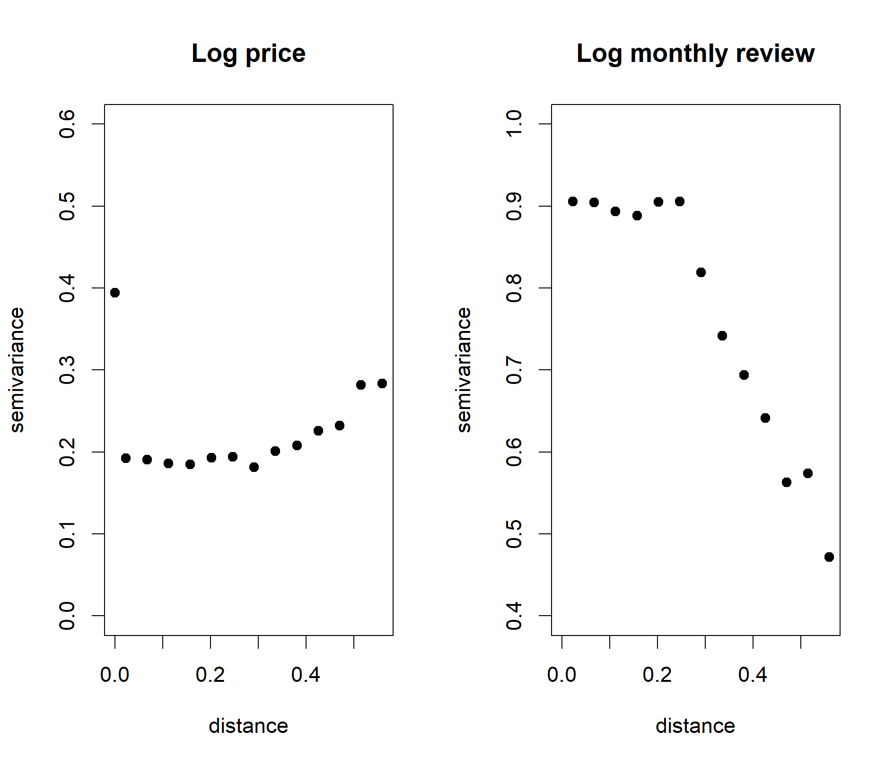

```{r setup, echo=FALSE}
library(knitr)
opts_chunk$set(echo = FALSE, 
               message = FALSE, 
               warning = FALSE,
               fig.align = 'center',
               out.width = '90%')
```

## Executive Summary


## 1. Introduction
Airbnb New York City Open Data collected in 2019 contains information of 48,895 airbnb listings in New York. The dataset has 16 variables, including listing name, location, price, number of reviews, etc. The analysis focuses on identifying most influential factors for price and popularity, examining heterogeneity across boroughs and neighbourhoods, as well as recommending best location and name for airbnb.

## 2. Materials and Methods
Before fitting our main model (bivariate mixed effect regression), we applied XGBoost to explore the importance of each predictor and conducted Pearson's chi-squared test to examine the heterogeneity across boroughs. Price and monthly reviews were grouped into 3 levels (below Q1, between Q1 and Q3, above Q3) for chi-squared test.

To understand which factors influence the price and popularity of a listing, we fit a bivariate response linear regression that has varying intercept across different neighbourhoods and boroughs. For the $i$-th listing in neighbourhood $j$, within borough $k$, the model can be written as
$$
\begin{gathered}
\left(\begin{array}{c} \text{Log Price}_{k[j[i]]} \\ \text{Log Monthly reviews}_{k[j[i]]}\end{array}\right) =
\left(\begin{array}{c} \boldsymbol{\beta}_1^T\mathbf{X}_i \\ \boldsymbol{\beta}_2^T\mathbf{X}_i\end{array}\right) +
\boldsymbol{\eta}_{k[j]} + \boldsymbol{\theta}_{j} + \boldsymbol{\epsilon}_{k[j[i]]},
\end{gathered}
$$
where $\boldsymbol{\eta}_{k[j]}$ is the $2\times 1$ vector of neighborhood-level random effect, $\boldsymbol{\theta}_j$ is the borough-level random effect, and $\boldsymbol{\epsilon}$ is an observation error that has $N(0, \sigma^2\mathbf{I}_2)$ distribution. The random intercepts are assumed to have a bivariate normal distribution centered at zero, so we can estimate the between-response correlation between boroughs and between neighborhoods, within boroughs. The model is fit through a standard MLE procedure implemented in `lme4` package for `R`. The slopes remain fixed across different groups, and the predictors for the two responses remain identical for the two responses.

## 3. Results

### 3.1 Exploratary Data Analysis and Preprocessing
For data preprocessing, we removed 14 observations with `minimum_nights` greater than a year and imputed missing data by setting missing `price` to 5 and missing `reviews_per_month` to 0. We grouped `last_review` by year and used the difference between last review year and 2019 as our predictor. Since it is unclear what quantity `availability_365` variable is measuring, or how precise a measure it can serve as for whatever quantity inherent to a listing, we created an indicator variable `available_spec` (availability specification) to indicate whether the listing is available (1) or not (0). We took natural logarithm of price and monthly review and use them as metrics of price and popularity respectively.

As shown in Figures 1 and 2, variable importance plots of XGBoost suggest that room type, availability, monthly reviews and boroughs are the most influential factors for price of airbnb. Last review year, availability, minimum nights and price are most important for monthly reviews.

Figures 3 to 5 present boxplots and mosaic plots for price, monthly review and room type across boroughs. As shown in the plots, price, popularity and room type differ across boroughs. For example, Manhanttan has the highest price and most listings there are entire homes or apartments. Queens, on the other hand, has the highest popularity and private rooms take up the most listings there. This agrees with the chi-squared test results, where the tests are all significant with p-values < 2e-16, suggesting there exists heterogeneity across boroughs.

### 3.2 Main Results

Figures \ref{fig:fixed_price} and \ref{fig:fixed_rev} each plot the interval estimates for the predictor coefficients for price and monthly reviews. Exact estimates, standard errors, and $t$-test statistics are shown in Table 1. Together, these results show that notwithstanding the "significance" of many of the predictors based on naive $t$-tests, many of the coefficients have too small a magnitude to have a meaningful impact on price or popularity adjusted for others. This is especially apparent when we compare them to the estimated standard deviations and correlations for the random intercepts (Tables 2 and 3). The only factor that has greater influence on average on price than the heterogeneity across different neighborhood groups is a listing's room type, as apartments/entire rooms are the most expensive on average, followed by private and shared rooms. For monthly review rate, influential factors include a listing's age, and whether a listing is available at the moment data were collected (non-zero `availability_365` variable). The negative coefficient for `last_review` implies a listing must be younger on average to have more reviews per month. 

### 3.3 Model Diagnostics
Our model does not explicitly account for possible spatial structure within neighborhoods. Assuming there exists such an autocorrelation structure, the semivariogram $\gamma$ of the response $Y$, which is defined as
$$\gamma(||\mathbf{h}||)\equiv \frac{1}{2}{\rm E}[Y(\mathbf{s+\mathbf{h}}) - Y(\mathbf{s})],$$
will exhibit a clear pattern in increasing pairwise distance $d\equiv||\mathbf{h}||$. Here, $\mathbf{s}$ indexes the listing's location, and $\mathbf{h}$ is the displacement vector. A customary, simple nonparametric estimator for semivariogram is (BCG, 2011)
$$\hat{\gamma}(d) = \frac{1}{2|N(d)|}\sum_{(\mathbf{s}_i,\mathbf{s}_j)\in N(d)} [Y(\mathbf{s}_i)-Y(\mathbf{s}_j)]^2,$$
where $N(d)$ consists of all pairs of locations that have a pairwise, geodesic distance $d$. The semivariogram estimators for each of the residuals are plotted on increasing pairwise distance in Figure \ref{fig:variogram}. It is clear based on the plots that while for price, no evidence of significant spatial structure is seen conditional on the negiborhood effects, a negative spatial autocorrelation exists for monthly review rates: closer things have more different responses, rather than similar. While seemingly counterintuitive, the negative autocorrelation can be explained by strong competition between listings when in close proximity. Within the same neighborhoods, a potential customer is always being sapped away from one listing to another, so the latter has at least one more review. Such effect will be strongly visible when listings are closer, but as distance increases, the dependence will become weak to none, and the variability of the difference between two monthly review rates will stabilize. That we do not see a similar negative autocorrelation in price is informative, as it suggests the hosts' pricing policy remains indifferent to their neighboring hosts, conditional on the neighborhood they belong to. 

## 4. Discussion
Our analysis was mainly intended to be exploratory, and the regression model fit in this report have many limitations. What we have discovered through EDA and model diagnostics, however, have important implications for application of more complex joint models. Most importantly, negative spatial autocorrelation for within-neighborhood monthly review rates raises concern for common spatial models including conditional autoregressive (CAR) models, which can only model positive autocorrelation. Models for repulsive point processes also exist in the literature, but our diagnostics show careis needed in jointly modeling the two responses when taking into account possible spatial structures. 

\clearpage

## References
Sarthak, N., Post: "Availability_365=0?", Discussion thread: New York City Airbnb Open Data, Kaggle. https://www.kaggle.com/dgomonov/new-york-city-airbnb-open-data/discussion/111835 

Banrjee, S., Carlin, B. P., and Gelfand, A. E. (2011). _Hierarchical Modeling and Analysis for Spatial Data_.

\clearpage

## Appendix: Figures and Tables
```{r message=FALSE, echo=FALSE, out.width = '85%', fig.align = "center"}
library(cowplot)
library(ggplot2)
library(magick)
p1 <- ggdraw() + draw_image("figures/XGBoost_LogPrice.png")
pp1<- plot_grid(p1)
ggdraw(add_sub(pp1, "Figure 1. XGBoost - Variable Importance Plots for Price", vpadding=grid::unit(0, "lines"), y = 3, x = 0.23, hjust = 0, size=8, fontface="bold"))
```

```{r message=FALSE, echo=FALSE, out.width = '85%', fig.align = "center"}
p1 <- ggdraw() + draw_image("figures/XGBoost_LogMonthlyReview.png")
pp1<- plot_grid(p1)
ggdraw(add_sub(pp1, "Figure 2. XGBoost - Variable Importance Plots for Monthly Review", vpadding=grid::unit(0, "lines"), y = 3, x = 0.23, hjust = 0, size=8, fontface="bold"))
```

```{r message=FALSE, echo=FALSE, out.width = '90%',fig.align = "center"}
p1 <- ggdraw() + draw_image("figures/Boxplot_PriceBoroughs.png")
p2 <- ggdraw() + draw_image("figures/Mosaic_PriceLevelBoroughs.png")
pp1<- plot_grid(p1, p2)
ggdraw(add_sub(pp1, "Figure 3. Boxplot and Mosaic Plot for Price across Boroughs", vpadding=grid::unit(0, "lines"), y = 8, x = 0.3, hjust = 0, size=8, fontface="bold"))
```

```{r message=FALSE, echo=FALSE, out.width = '90%',fig.align = "center"}
p1 <- ggdraw() + draw_image("figures/Boxplot_MonthlyReviewBoroughs.png")
p2 <- ggdraw() + draw_image("figures/Mosaic_PopularityLevelBoroughs.png")
pp1<- plot_grid(p1, p2)
ggdraw(add_sub(pp1, "Figure 4. Boxplot and Mosaic Plot for Monthly Review across Boroughs", vpadding=grid::unit(0, "lines"), y = 8, x = 0.28, hjust = 0, size=8, fontface="bold"))
```

```{r message=FALSE, echo=FALSE, out.width = '85%',fig.align = "center"}
p1 <- ggdraw() + draw_image("figures/Mosaic_RoomTypeBoroughs.png")
pp1<- plot_grid(p1)
ggdraw(add_sub(pp1, "Figure 5. Mosaic Plot for Room Type across Boroughs", vpadding=grid::unit(0, "lines"), y = 1, x = 0.36, hjust = 0, size=8, fontface="bold"))
```


```{r, fig.cap="\\label{fig:zero_vs_non} Distribution of log monthly review rates for listings with zero/non-zero availability feature."}
include_graphics("figures/available_zero_or_non.png")
```

```{r, fig.cap="\\label{fig:fixed_price} Fixed effect estimates for log price."}
include_graphics("figures/coef_price.png")
```

```{r, fig.cap="\\label{fig:fixed_rev} Fixed effect estimates for log monthly review rates."}
include_graphics("figures/coef_review.png")
```

```{r, fig.cap="\\label{fig:variogram} Semivariogram estimators calculated from model residuals for price and monthly review rates."}

```


