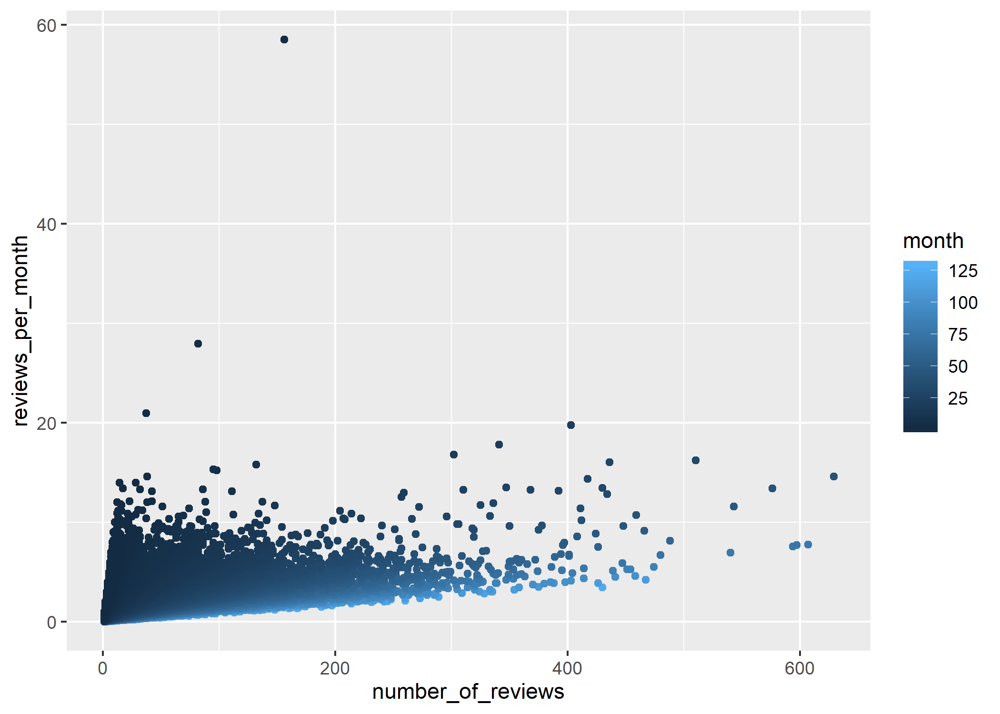
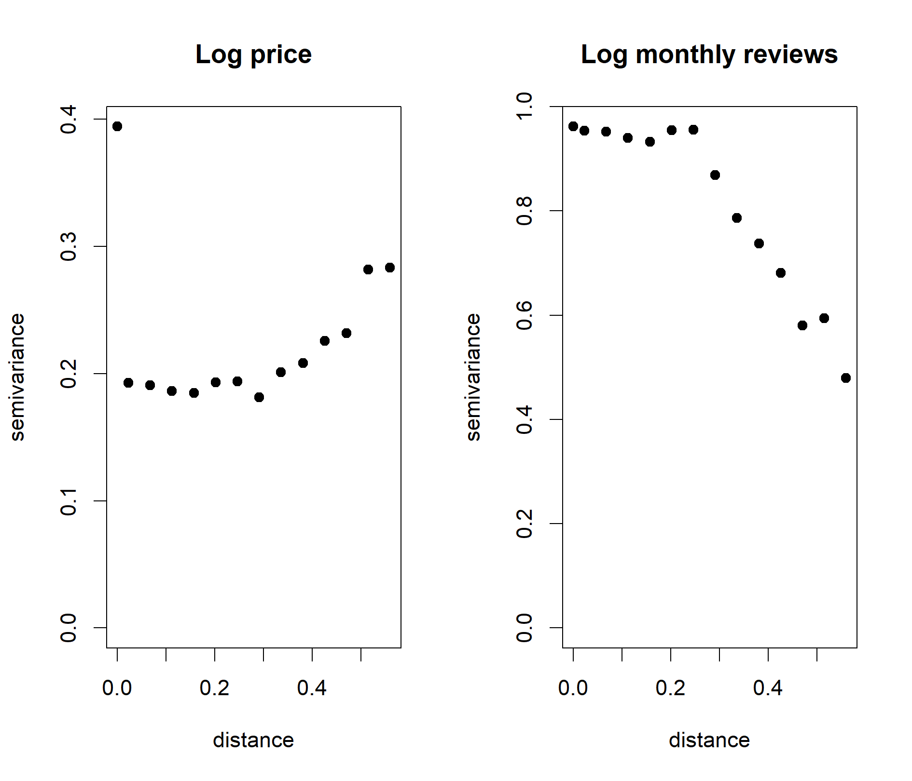

```{r setup, include=FALSE}
library(knitr)
opts_chunk$set(echo = FALSE, 
                      message = FALSE, 
                      warning = FALSE,
                      fig.align = 'center',
                      out.width = '90%')
library(cowplot)
library(dplyr)
library(ggplot2)
library(lubridate)
# Dataset we are using (ref. to as airbnb)
airbnb <- read.csv("./AB_NYC_2019.csv") %>% 
    mutate(price = ifelse(price==0, 5, price),
           reviews_per_month = ifelse(is.na(reviews_per_month), 0, reviews_per_month),
           last_review = 2019 - year(ymd(last_review)),
           available_spec = (availability_365 != 0) ) %>%
    # available_spec does not actually mean "available," but rather two diff. groups
    # that have specified the variable or not
    # Whichever listings without any review will have NA values!
    filter(minimum_nights <= 365)
```

### Introduction

* Data: Airbnb New York City open data collected from 2019, with 48,895 listings and 16 variables.  
  
* Goals:  
  + Identify most influential factors for price/popularity  
  + Examine heterogeneity across boroughs and neighbourhoods  
  + Recommend best location and name for airbnb

### Data Processing

* Remove 14 observations with *minimum_nights* > 365
* *Price*: the lowest non-zero value is 10, added 5 to 0's 
* *Reviews per Month*: missing values are set to 0 (last review dates are missing and total number of reviews are 0)
* *Last Review*: group by years from 2019 (e.g. 2019 -> 0; 2018 -> 1, etc.)
* *availability_365*: create a new variable *available_spec* to indicate whether the value is 0

### What is a Valid Metric for Popularity?

```{r}

```

* __Monthly reviews__ adjusts for the history of a listing (albeit not perfectly)

### Heterogeneity of Price across Boroughs
```{r message=FALSE, echo=FALSE, out.width = '90%',fig.align = "center"}
p1 <- ggdraw() + draw_image("figures/Boxplot_PriceBoroughs.png")
p2 <- ggdraw() + draw_image("figures/Mosaic_PriceLevelBoroughs.png")
pp1<- plot_grid(p1, p2)
ggdraw(pp1)
```
  
* Generate 3 price levels:  
"below Q1", "between Q1 and Q3", "above Q3"  
  
* Pearson's Chi-squared test: p-value < 2.2e-16

### Heterogeneity of Popularity across Boroughs
```{r message=FALSE, echo=FALSE, out.width = '90%',fig.align = "center"}
p1 <- ggdraw() + draw_image("figures/Boxplot_MonthlyReviewBoroughs.png")
p2 <- ggdraw() + draw_image("figures/Mosaic_PopularityLevelBoroughs.png")
pp1<- plot_grid(p1, p2)
ggdraw(pp1)
```
    
* Generate 3 popularity levels:  
"below Q1", "between Q1 and Q3", "above Q3"   
  
* Pearson's Chi-squared test: p-value < 2.2e-16

### Heterogeneity of Room type across Boroughs
```{r message=FALSE, echo=FALSE, out.width = '70%',fig.align = "center"}
p1 <- ggdraw() + draw_image("figures/Mosaic_RoomTypeBoroughs.png")
pp1<- plot_grid(p1)
ggdraw(pp1)
```

* Pearson's Chi-squared test: p-value < 2.2e-16

### Price: XGBoost for Important Variables
```{r message=FALSE, echo=FALSE, out.width = '75%',fig.align = "center"}
p1 <- ggdraw() + draw_image("figures/XGBoost_LogPrice.png")
pp1<- plot_grid(p1)
ggdraw(pp1)
```

* The most influential factors for price of airbnb include: room type (private room), availability, monthly reviews, boroughs (Manhattan), etc.

### Popularity: XGBoost for Important Variables
```{r message=FALSE, echo=FALSE, out.width = '75%',fig.align = "center"}
p1 <- ggdraw() + draw_image("figures/XGBoost_LogMonthlyReview.png")
pp1<- plot_grid(p1)
ggdraw(pp1)
```

* The most influential factors for popularity of airbnb include: last review (in years from 2019), availability, minimum nights, price, etc.

### EDA - Price and Popularity

* From XGBoost outputs, price and popularity are closely related, both being an important variable of the other.  

* The plot below shows a negative correlation between them on _log-scale_:

```{r message=FALSE, echo=FALSE, out.width = '70%',fig.align = "center"}
p1 <- ggdraw() + draw_image("figures/MonthlyReview_Price.png")
pp1<- plot_grid(p1)
ggdraw(pp1)
```
* We may consider model them as bivariate reponse.

### Possibly Unreliable Predictors

```{r}
# Change figure sizes!
p1 <- ggdraw() + draw_image("figures/available_zero_or_non.png")
p2 <- ggdraw() + draw_image("figures/available_monthly_neg.png")
p12 <- plot_grid(p1, p2)
ggdraw(p12)
```

### Modeling: Bivariate Mixed Effects Regression

  * Varying intercept model: Random effects for each neighbourhood, and each borough

$$
\begin{gathered}
\text{For the }i-\text{th observation in neighbourhood }j\text{, in borough }k,\\
\left(\begin{array}{c} \text{Price}_{k[j[i]]} \\ \text{Monthly review}_{k[j[i]]}\end{array}\right) =
\left(\begin{array}{c} \boldsymbol{\beta}_1^T\mathbf{X}_i \\ \boldsymbol{\beta}_2^T\mathbf{X}_i\end{array}\right) +
\boldsymbol{\eta}_{k[j]} + \boldsymbol{\theta}_{j} + \boldsymbol{\epsilon}_{k[j[i]]},\\
\boldsymbol{\epsilon} \sim N(\mathbf{0}, \sigma^2I_2).
\end{gathered}
$$

  * Quadratic term for how "old" a listing is included

  * Observations with no reviews excluded (`r round(sum(airbnb$reviews_per_month == 0)/nrow(airbnb), 2)*100`\% of the data)

### What Are the Important Predictors for Price/Popularity?

```{r, include=F, cache=T}
# Model code included just in case, for reproducibility
# Can set eval=F if takes time
library(lme4)
library(reshape2)
data_for_bv <- airbnb %>% select(-id, -name, -host_id, -host_name, -latitude, -longitude) %>% 
  filter(reviews_per_month!=0) %>% # For log-transform
  mutate(price = log(price), reviews_per_month = log(reviews_per_month))
data_for_bv_melt <- data_for_bv %>% select(price, reviews_per_month) %>% melt(.)
data_for_bv <- cbind.data.frame(data_for_bv_melt, data_for_bv[,-c(4, 8)])
mod3 <- lmer(value ~ variable:(room_type + 
                                 last_review + I(last_review^2)+ 
                                 minimum_nights + 
                                 availability_365 + calculated_host_listings_count + 
                                 available_spec)-1 + 
               ((variable-1)|neighbourhood_group/neighbourhood),
             data = data_for_bv,
             control = lmerControl(optCtrl = list(ftol_abs = 1e-10)))
```


```{r}
g1 <- ggdraw() + draw_image("figures/coef_price.png")
g2 <- ggdraw() + draw_image("figures/coef_review.png")
g12 <- plot_grid(g1, g2)
ggdraw(g12)
```

  * In terms of magnitude, not significance, __room type__ for price, and __last review__ for popularity
  
  * Apartments > Pvt room > Shared room for price, and more popular if the listing is young

### Estimates for Group Heterogeneities

```{r}
kable(VarCorr(mod3)[[1]], format = "latex", align = "c")
kable(VarCorr(mod3)[[2]], format = "latex", align = "c")
```

  * Many coefficients for significant predictors (adjusted for other variables) are swamped by the variability within/between different neighborhoods and boroughs
  
  * Negative correlation between coefficients for price and popularity

### Examining Spatial Correlation of the Residuals

```{r}

```

  * We observe large semivariogram for price when listings are extremely close, and __negative spatial correlation__ for monthly review rates

### Possible Insights

  * When two listings are very close (identical coordinates), the market effect takes sway over all others. One potential customer is being sapped away from one listing to another.
  
  * As a result, closer things have more dissimilar popularity measures. As distance increases, however, the effect becomes less severe and association between a listing's features and sales becomes noticeable.
  
  * However, price is relatively "inelastic"; unless two listings are extremely close to each other, the hosts' pricing policy remains relatively indifferent to their neighbors, adjusted for other features of a listing.
  
  * Hence, we observe no evidence of spatial correlation, conditional on what neighborhood a listing belongs to, except in extreme proximity (high semivariogram for price).

### Text Analysis for Listing Names

(...Phuc's analysis...)

### Limitations and Further Work

  * Including varying slopes calls for strong shrinkage

  * Care is needed for spatial covariance models: "soft" adjacency matrix for neighborhoods/boroughs, negative autocorrelation, etc.

  * Missing data/latent space model for `availability_365`
  
  * Nonparametric approach for bivariate model
  
  