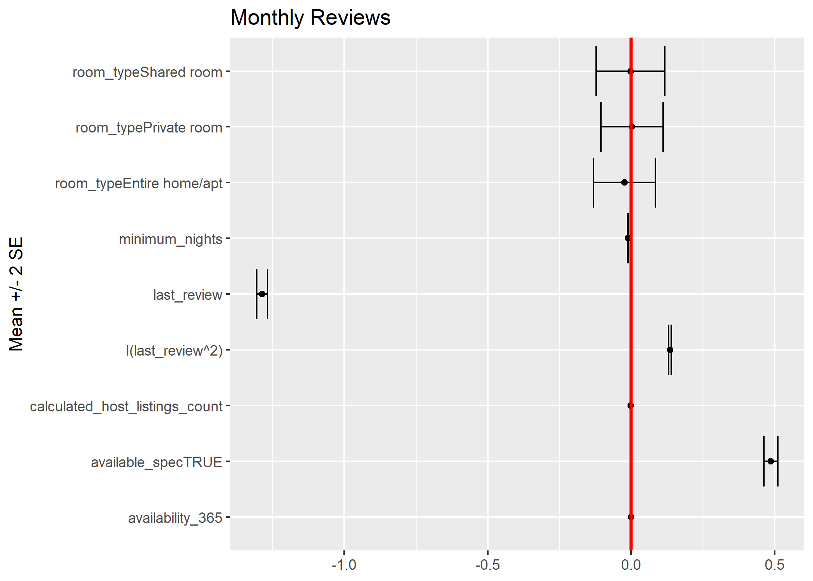

```{r setup, include=FALSE}
library(knitr)
library(lme4)
opts_chunk$set(echo = FALSE, 
                      message = FALSE, 
                      warning = FALSE,
                      fig.align = 'center',
                      out.width = '90%')
library(cowplot)
library(dplyr)
library(ggplot2)
library(lme4)
library(lubridate)
# Dataset we are using (ref. to as airbnb)
airbnb <- read.csv("./AB_NYC_2019.csv") %>% 
    mutate(price = ifelse(price==0, 5, price),
           reviews_per_month = ifelse(is.na(reviews_per_month), 0, reviews_per_month),
           last_review = 2019 - year(ymd(last_review)),
           available_spec = (availability_365 != 0) ) %>%
    # available_spec does not actually mean "available," but rather two diff. groups
    # that have specified the variable or not
    # Whichever listings without any review will have NA values!
    filter(minimum_nights <= 365)
```

### Data Processing
* Remove 14 observations with *minimum_nights* > 365
* *Price*: the lowest non-zero value is 10, change 0 to 5 
* *Reviews per Month*: missing values are set to 0 (there is no review for these listings)
* *Last Review*: group by years from 2019 (e.g. 2019 -> 0; 2018 -> 1, etc.)

### Response Variables - Price and Popularity
* Metric for price: __price__  

* Metric for popularity: __monthly reviews__ adjusts for the history of a listing (albeit not perfectly)

* Price and popularity seem to be negatively correlated (in log scale)

### XGBoost for Important Variables
```{r message=FALSE, echo=FALSE, out.width = '100%',fig.align = "center"}
p1 <- ggdraw() + draw_image("figures/XGBoost_LogPrice.png")
p2 <- ggdraw() + draw_image("figures/XGBoost_LogMonthlyReview.png")
pp1<- plot_grid(p1, p2)
ggdraw(pp1)
```

* Most important variable for price: *Room Type*.

* Most important variable for popularity: *Last Review* (age of the listings).

* Price and popularity are closely related, both being an important variable of the other. We may consider model them as bivariate reponse.  

### Heterogeneity of Price / Popularity across Boroughs
* Create new variables "Price Level" and "Popularity Level":  
  + "Low" for values < 25th Percentile
  + "Medium" for values between 25th and 75th Percentile  
  + "High" for values > 75th Percentile  
  
* Create contingency table and conduct Chi-squared Test for Homogeneity  

### Heterogeneity of Price / Popularity across Boroughs

```{r message=FALSE, echo=FALSE, out.width = '90%',fig.align = "center"}
p1 <- ggdraw() + draw_image("figures/Boxplot_PriceBoroughs.png")
p2 <- ggdraw() + draw_image("figures/Mosaic_PriceLevelBoroughs.png")
p3 <- ggdraw() + draw_image("figures/Boxplot_MonthlyReviewBoroughs.png")
p4 <- ggdraw() + draw_image("figures/Mosaic_PopularityLevelBoroughs.png")
pp1<- plot_grid(p1, p2, p3, p4)
ggdraw(pp1)
```
  
* Small p-value suggests heterogeneity across boroughs.

### Heterogeneity of Room type across Boroughs
```{r message=FALSE, echo=FALSE, out.width = '60%',fig.align = "center"}
p1 <- ggdraw() + draw_image("figures/Mosaic_RoomTypeBoroughs.png")
pp1<- plot_grid(p1)
ggdraw(pp1)
```

* Small p-value suggests heterogeneity across boroughs.

### Unreliability of Availability Feature

  * `availability_365`: Only important info. seems to come from whether it is zero or not

```{r}
include_graphics("figures/available_zero_or_non.png")
```

### Modeling: Bivariate Mixed Effects Regression

  * Varying intercept model: For the $i$-th listing in neighborhood $j$, within borough $k$,
$$
\begin{gathered}
\left(\begin{array}{c} \text{Price}_{k[j[i]]} \\ \text{Monthly review}_{k[j[i]]}\end{array}\right) =
\left(\begin{array}{c} \boldsymbol{\beta}_1^T\mathbf{X}_i \\ \boldsymbol{\beta}_2^T\mathbf{X}_i\end{array}\right) +
\boldsymbol{\eta}_{k[j]} + \boldsymbol{\theta}_{j} + \boldsymbol{\epsilon}_{k[j[i]]}.
\end{gathered}
$$

  * Availability is included both as an non-zero indicator and numeric variables 

  * Quadratic term of the listing's age is included

  * Observations with no reviews excluded (`r round(sum(airbnb$reviews_per_month == 0)/nrow(airbnb), 2)*100`\% of the data)

### What Are the Important Predictors for Price?

```{r, include=F, cache=T}
# Model code included just in case, for reproducibility
# Can set eval=F if takes time
library(reshape2)
data_for_bv <- airbnb %>% select(-id, -name, -host_id, -host_name, -latitude, -longitude) %>% 
  filter(reviews_per_month!=0) %>% # For log-transform
  mutate(price = log(price), reviews_per_month = log(reviews_per_month))
data_for_bv_melt <- data_for_bv %>% select(price, reviews_per_month) %>% melt(.)
data_for_bv <- cbind.data.frame(data_for_bv_melt, data_for_bv[,-c(4, 8)])
mod3 <- lmer(value ~ variable:(room_type + 
                                 last_review + I(last_review^2)+ 
                                 minimum_nights + 
                                 availability_365 + calculated_host_listings_count + 
                                 available_spec)-1 + 
               ((variable-1)|neighbourhood_group/neighbourhood),
             data = data_for_bv,
             control = lmerControl(optCtrl = list(ftol_abs = 1e-10)))
```

```{r}
include_graphics("figures/coef_price.png")
```

  * Apartment > Pvt room > Shared room in price
  
### What Are the Important Predictors for Popularity?

```{r}

```

  * To have reviews, a listing on average should be young and actually on business

### Random Intercepts for Groups

```{r}
kable(coefficients(mod3)[[2]][,1:2], format = "latex", align = "c", digits = 2)
```

  * Manhattan most expensive, Queens most popular

  * Strong negative correlation between two random intercepts between boroughs (`r round(attr(lme4::VarCorr(mod3)[[2]], "correlation")[1,2], 2)`) 
  
  * Neighborhood-level variation is relatively minute

### Examining Spatial Correlation of the Residuals

  * Plotting semivariogram as evidence of within-neighborhood spatial structure

```{r, out.width='4in', out.height='2in'}
include_graphics("figures/empirical_variograms.png")
```

  * We observe large semivariogram for price when listings are extremely close, and __negative spatial correlation__ for monthly review rates

### Possible Insights

  * When two listings are very close (identical coordinates), the market effect takes sway over all others. One potential customer is being sapped away from one listing to another.
  
  * As a result, closer things have more dissimilar popularity measures. As distance increases, however, the effect becomes less severe and association between a listing's features and sales becomes noticeable.
  
   * However, price is relatively "inelastic"; unless two listings are extremely close to each other, the hosts' pricing policy remains relatively indifferent to their neighbors, adjusted for other features of a listing.
  
  * Hence, we observe no evidence of spatial correlation, conditional on what neighborhood a listing belongs to, except in extreme proximity (high semivariogram).

### Text Analysis for Listing Names

```{r message=FALSE, echo=FALSE, out.width = '85%',fig.align = "center"}
p2 <- ggdraw() + draw_image("figures/wordcloud_count.png")
pp1<- plot_grid(p2)
ggdraw(pp1)
```

### Text Analysis for Listing Names

```{r message=FALSE, echo=FALSE, out.width = '100%',fig.align = "center"}
p1 <- ggdraw() + draw_image("figures/wordcloud_manhattan.png")
p2 <- ggdraw() + draw_image("figures/wordcloud_brooklyn.png")
p3 <- ggdraw() + draw_image("figures/wordcloud_queens.png")
p4 <- ggdraw() + draw_image("figures/wordcloud_bronx.png")
pp1<- plot_grid(p1, p2, p3, p4)
ggdraw(pp1)
```

"2 minutes to Midtown Manhattan", "Beautiful Brooklyn brownstone", "Cozy home in Astoria", "Home near Bronx Zoo".

### Foreign language, Special Characters, and Misspelling

Examples: "PrimChelsea1BR\~Sleeps4\~hugeOutdoor", "yahmanscrashpads"  

```{r message=FALSE, echo=FALSE, out.width = '90%',fig.align = "center"}
p1 <- ggdraw() + draw_image("figures/coef_price_name.png")
p2 <- ggdraw() + draw_image("figures/coef_review_name.png")
pp1<- plot_grid(p1, p2)
ggdraw(pp1)
```

* Listing names with no whitespace have lower monthly reviews
* Listing in foreign languages have higher monthly reviews

### Conclusions

* Price:   
  + Manhattan: most expensive; Staten Island: least expensive  
  + Entire home > Private room > Shared room  
  
* Popularity:  
  + Queens: most popular; Brooklyn: least popular  
  + Active and/or new listings  
  + Well-written names  
  
* Our listing: Entire home in Astoria, Queens

### Limitations and Further Work

* Including varying slopes calls for strong shrinkage

* Care is needed for spatial covariance models: "soft" adjacency matrix for neighborhoods/boroughs, negative autocorrelation, etc.

* Missing data, zero reviews
  
* Nonparametric approach for bivariate model
  
  