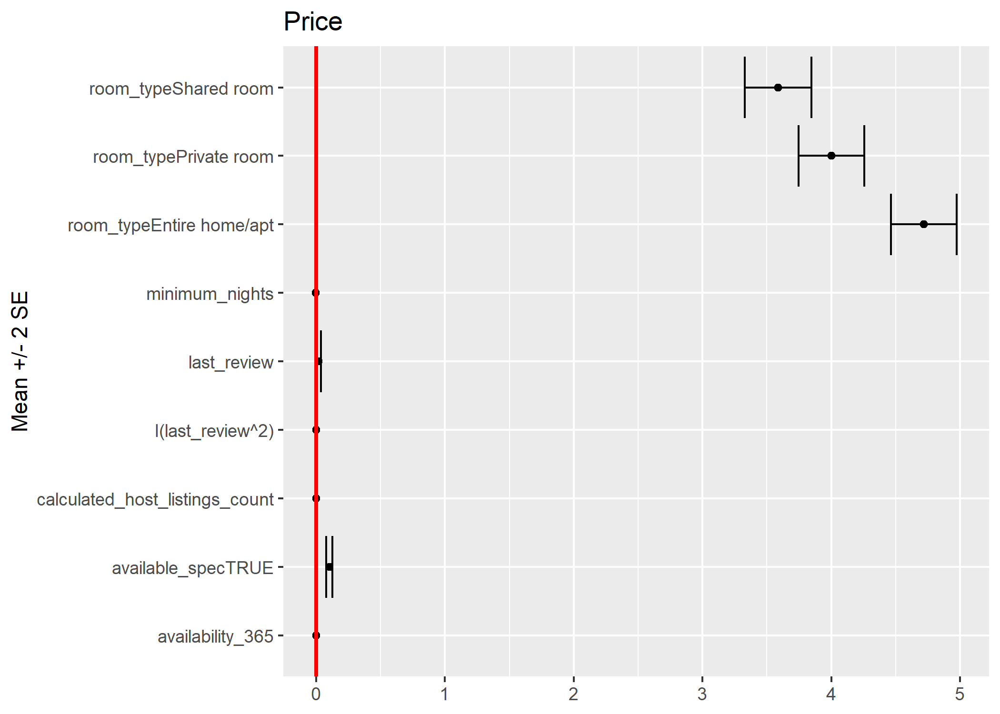

```{r setup, include=FALSE}
library(knitr)
library(lme4)
opts_chunk$set(echo = FALSE, 
                      message = FALSE, 
                      warning = FALSE,
                      fig.align = 'center',
                      out.width = '90%')
library(cowplot)
library(dplyr)
library(ggplot2)
library(lme4)
library(lubridate)
# Dataset we are using (ref. to as airbnb)
airbnb <- read.csv("./AB_NYC_2019.csv") %>% 
    mutate(price = ifelse(price==0, 5, price),
           reviews_per_month = ifelse(is.na(reviews_per_month), 0, reviews_per_month),
           last_review = 2019 - year(ymd(last_review)),
           available_spec = (availability_365 != 0) ) %>%
    # available_spec does not actually mean "available," but rather two diff. groups
    # that have specified the variable or not
    # Whichever listings without any review will have NA values!
    filter(minimum_nights <= 365)
```

### Introduction
* Data: Airbnb New York City open data collected from 2019, with 48,895 listings and 16 variables.  
  
* Goals:  
  + Identify most influential factors for price/popularity  
  + Examine heterogeneity across boroughs and neighbourhoods  
  + Recommend best location and name for airbnb

### Data Processing
* Remove 14 observations with *minimum_nights* > 365
* *Price*: the lowest non-zero value is 10, added 5 to 0's 
* *Reviews per Month*: missing values are set to 0 (last review dates are missing and total number of reviews are 0)
* *Last Review*: group by years from 2019 (e.g. 2019 -> 0; 2018 -> 1, etc.)
* *availability_365*: create a new variable *available_spec* to indicate whether the value is 0

### What is a Valid Metric for Popularity?

```{r}
include_graphics("figures/monthly_vs_raw.png")
```

* __Monthly reviews__ adjusts for the history of a listing (albeit not perfectly)

### EDA - Price and Popularity
* Price and popularity seem to be negatively correlated (with extreme values):
```{r message=FALSE, echo=FALSE, out.width = '70%',fig.align = "center"}
p1 <- ggdraw() + draw_image("figures/MonthlyReview_Price.png")
pp1<- plot_grid(p1)
ggdraw(pp1)
```

### XGBoost for Important Variables
```{r message=FALSE, echo=FALSE, out.width = '100%',fig.align = "center"}
p1 <- ggdraw() + draw_image("figures/XGBoost_LogPrice.png")
p2 <- ggdraw() + draw_image("figures/XGBoost_LogMonthlyReview.png")
pp1<- plot_grid(p1, p2)
ggdraw(pp1)
```

* The most influential factors for price include: room type, availability, monthly reviews, boroughs, etc.  

* The most influential factors for popularity include: last review, availability, price, etc.  

* Price and popularity are closely related, both being an important variable of the other. We may consider model them as bivariate reponse.  

### Heterogeneity of Price / Popularity across Boroughs
* Create new variables "Price Level" and "Popularity Level":  
  + "Low" for values < 25th Percentile
  + "Medium" for values between 25th and 75th Percentile  
  + "High" for values > 75th Percentile  
  
* Create contingency table and conduct Chi-squared Test for Homogeneity  

### Heterogeneity of Price / Popularity across Boroughs

```{r message=FALSE, echo=FALSE, out.width = '90%',fig.align = "center"}
p1 <- ggdraw() + draw_image("figures/Boxplot_PriceBoroughs.png")
p2 <- ggdraw() + draw_image("figures/Mosaic_PriceLevelBoroughs.png")
p3 <- ggdraw() + draw_image("figures/Boxplot_MonthlyReviewBoroughs.png")
p4 <- ggdraw() + draw_image("figures/Mosaic_PopularityLevelBoroughs.png")
pp1<- plot_grid(p1, p2, p3, p4)
ggdraw(pp1)
```
  
* Small p-value suggests heterogeneity across boroughs.

### Heterogeneity of Popularity and Price across Boroughs

```{r, fig.show = "hold",out.width="50%", fig.align = "default"}


```

### Heterogeneity of Room type across Boroughs
```{r message=FALSE, echo=FALSE, out.width = '60%',fig.align = "center"}
p1 <- ggdraw() + draw_image("figures/Mosaic_RoomTypeBoroughs.png")
pp1<- plot_grid(p1)
ggdraw(pp1)
```

* Small p-value suggests heterogeneity across boroughs.

### Unreliability of Availability Feature

```{r}

```

On average, it seems the listings that are "temporarily unavailable" (zero availability) have lower monthly review rate...

### Unreliability of Availability Feature

```{r}

```

...but _conditioned on_ non-zero availability, the association is less obvious (can be negative?).

### Modeling: Bivariate Mixed Effects Regression

  * Varying intercept model: For the $i$-th listing in neighborhood $j$, within borough $k$,
$$
\begin{gathered}
\left(\begin{array}{c} \text{Price}_{k[j[i]]} \\ \text{Monthly review}_{k[j[i]]}\end{array}\right) =
\left(\begin{array}{c} \boldsymbol{\beta}_1^T\mathbf{X}_i \\ \boldsymbol{\beta}_2^T\mathbf{X}_i\end{array}\right) +
\boldsymbol{\eta}_{k[j]} + \boldsymbol{\theta}_{j} + \boldsymbol{\epsilon}_{k[j[i]]}.
\end{gathered}
$$

  * Both "availability specification" and raw availability count are included as predictors

  * Quadratic term of the listing's age is included

  * Observations with no reviews excluded (`r round(sum(airbnb$reviews_per_month == 0)/nrow(airbnb), 2)*100`\% of the data)

### What Are the Important Predictors for Price?

```{r, include=F, cache=T}
# Model code included just in case, for reproducibility
# Can set eval=F if takes time
library(reshape2)
data_for_bv <- airbnb %>% select(-id, -name, -host_id, -host_name, -latitude, -longitude) %>% 
  filter(reviews_per_month!=0) %>% # For log-transform
  mutate(price = log(price), reviews_per_month = log(reviews_per_month))
data_for_bv_melt <- data_for_bv %>% select(price, reviews_per_month) %>% melt(.)
data_for_bv <- cbind.data.frame(data_for_bv_melt, data_for_bv[,-c(4, 8)])
mod3 <- lmer(value ~ variable:(room_type + 
                                 last_review + I(last_review^2)+ 
                                 minimum_nights + 
                                 availability_365 + calculated_host_listings_count + 
                                 available_spec)-1 + 
               ((variable-1)|neighbourhood_group/neighbourhood),
             data = data_for_bv,
             control = lmerControl(optCtrl = list(ftol_abs = 1e-10)))
```

```{r}

```

  * Many predictors are significant, but __room type__ only seems to be associated to large enough increase in price
  
### What Are the Important Predictors for Popularity?

```{r}
include_graphics("figures/coef_review.png")
```

  * The younger the listing is, the more it is popular on average (in spite of significance of the quadratic term)

### Estimates for Group Heterogeneities

```{r}
kable(VarCorr(mod3)[[1]], format = "latex", row.names = F, align = "c", digits = 2)
kable(VarCorr(mod3)[[2]], format = "latex", row.names = F, align = "c", digits = 2)
```

  * Many significant coefficients can be swamped by the variability within/between different neighborhoods and boroughs
  
  * Strong negative correlation between two random intercepts between boroughs (`r round(attr(lme4::VarCorr(mod3)[[2]], "correlation")[1,2], 2)`) 

### Examining Spatial Correlation of the Residuals

  * Semivariograms: For location $\mathbf{s}_i$, estimate ${\rm Var}(Y(\mathbf{s}_i + d) - Y(\mathbf{s}_i))$ in increasing distance $d$.

```{r, out.width='4in', out.height='2in'}
include_graphics("figures/empirical_variograms.png")
```

  * We observe large semivariogram for price when listings are extremely close, and __negative spatial correlation__ for monthly review rates

### Possible Insights

  * When two listings are very close (identical coordinates), the market effect takes sway over all others. One potential customer is being sapped away from one listing to another.
  
  * As a result, closer things have more dissimilar popularity measures. As distance increases, however, the effect becomes less severe and association between a listing's features and sales becomes noticeable.
  
   * However, price is relatively "inelastic"; unless two listings are extremely close to each other, the hosts' pricing policy remains relatively indifferent to their neighbors, adjusted for other features of a listing.
  
  * Hence, we observe no evidence of spatial correlation, conditional on what neighborhood a listing belongs to, except in extreme proximity (high semivariogram).

### Text Analysis for Listing Names

```{r, out.width="80%", fig.show = "hold", fig.align = "default"}

```

### Text Analysis for Listing Names

```{r, fig.show = "hold", out.width="33%", fig.align = "default"}


```

### Foreign language, Special Characters, and Misspelling

> "PrimChelsea1BR\~Sleeps4\~hugeOutdoor"
> "yahmanscrashpads"


```{r, fig.show = "hold", out.width="50%", fig.align = "default"}


```


```{r, cache=TRUE, eval=FALSE}
badnames <- airbnb %>%
  mutate(name = sub("[[:punct:]]", "", name)) %>%
  mutate(foreign = 1 * grepl("IS_NOT_ENGLISH", iconv(name, "latin1", "ASCII", sub="IS_NOT_ENGLISH"))) %>%  # remove non latin words
  mutate(name_nospace = 1 * (!grepl(" ", name) & foreign == 0))

data_for_bv <- badnames %>% select(-id, -name, -host_id, -host_name, -latitude, -longitude) %>% 
  filter(reviews_per_month!=0) %>% # For log-transform
  mutate(price = log(price), reviews_per_month = log(reviews_per_month))
data_for_bv_melt <- data_for_bv %>% select(price, reviews_per_month) %>% melt(.)
data_for_bv <- cbind.data.frame(data_for_bv_melt, data_for_bv[,-c(4, 8)])
mod_name <- lmer(value ~ variable:(room_type + 
                                 last_review + I(last_review^2)+ 
                                 minimum_nights + 
                                 availability_365 + calculated_host_listings_count + 
                                 available_spec +
                                foreign + name_nospace)-1 + 
               ((variable-1)|neighbourhood_group/neighbourhood),
             data = data_for_bv,
             control = lmerControl(optCtrl = list(ftol_abs = 1e-10)))
```

```{r, eval=FALSE}
fixed <- summary(mod_name)$coefficients
fixed_price <- fixed[grepl("price", row.names(fixed)),1:2]
fixed_rev <- fixed[grepl("reviews_per_month", row.names(fixed)),1:2]
fixed_price <- cbind.data.frame(
    melt(fixed_price)[melt(fixed_price)$Var2 != "Std. Error", c("Var1", "value")], 
    lower = fixed_price[,1] - 2 * fixed_price[,2],
    upper = fixed_price[,1] + 2 * fixed_price[,2]) %>%
    filter(grepl("room_type|foreign|name_nospace", Var1))
fixed_rev <- cbind.data.frame(
    melt(fixed_rev)[melt(fixed_rev)$Var2 != "Std. Error", c("Var1", "value")], 
    lower = fixed_rev[,1] - 2 * fixed_rev[,2],
    upper = fixed_rev[,1] + 2 * fixed_rev[,2]) %>%
    filter(grepl("last_review|available_specTRUE|foreign|name_nospace", Var1))
fixed_price$Var1 <- unlist(
    lapply(
        strsplit(as.character(fixed_price$Var1), split = ":"), 
        function(x) x[2]
    )
)
fixed_rev$Var1 <- unlist(
    lapply(
        strsplit(as.character(fixed_rev$Var1), split = ":"), 
        function(x) x[2]
    )
)
g1 <- ggplot(fixed_price) + 
    geom_point(aes(x = Var1, y = value)) + 
    geom_errorbar(aes(x = Var1, ymin = lower, ymax = upper)) + 
    geom_hline(yintercept = 0, col = "red", lwd = 1) +
    labs(x= "Mean +/- 2 SE", y = NULL, title = "Price") + coord_flip()
g2 <- ggplot(fixed_rev) + 
    geom_point(aes(x = Var1, y = value)) + 
    geom_errorbar(aes(x = Var1, ymin = lower, ymax = upper)) +
    geom_hline(yintercept = 0, col = "red", lwd = 1) +
    labs(x= "Mean +/- 2 SE", y = NULL, title = "Monthly Reviews") + coord_flip()

ggsave(filename = "figures/coef_price_name.png", plot = g1, device = "png", width = 7, height = 5, units = "in")
ggsave(filename = "figures/coef_review_name.png", plot = g2, device = "png", width = 7, height = 5, units = "in")
```

### Conclusions

  * Price: 
  
- Manhattan: most expensive; Staten Island: least expensive
- Entire home > Private room > Shared room
  
  * Popularity:
  
- Queens: most popular; Brooklyn: least popular
- Active and/or new listings
- Well-written names

### Limitations and Further Work

  * Including varying slopes calls for strong shrinkage

  * Care is needed for spatial covariance models: "soft" adjacency matrix for neighborhoods/boroughs, negative autocorrelation, etc.

  * Missing data, zero reviews
  
  * Nonparametric approach for bivariate model
  
  